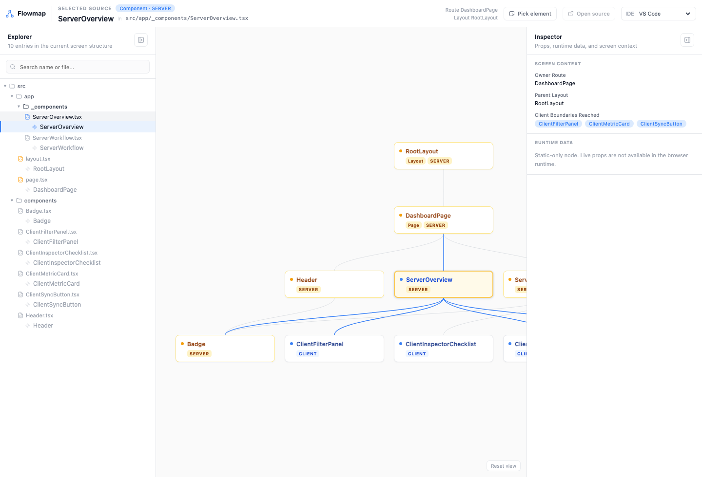

# react-flowmap

A dev-only screen-to-code inspector for React and Next.js apps that helps you see which components, files, and route context compose the current screen.

- **Pick mode** — click any UI fragment on screen to inspect its owning component
- **Workspace button** — open the full analysis workspace directly from the app window
- **Component tree** — browse the current screen's component / route structure with search and folder grouping
- **Graph view** — explore the currently rendered screen structure inside the current route subtree
- **Props** — inspect live prop values with TypeScript type hints and jump-to-source
- **Unified graph** — route, server, and client ownership nodes share the same graph with `SERVER` / `CLIENT` badges
- **Fragment support** — components rendering multiple root elements are highlighted across their full area

> Dev-only. Instrumentation runs only in development mode — zero code injected in production builds.

React Flowmap is built for questions like:

- "What component owns this UI?"
- "Which file should I open to change this part of the screen?"
- "How is this screen assembled right now?"
- "Which route or layout is this UI rendered under?"
- "Which parts are already componentized, and which areas still look like parent-owned markup?"

It is **not** trying to replace Chrome DevTools or become a general runtime analysis platform.

## Framework support

| Target | Status | What's tracked |
|---|---|---|
| Vite + React apps | ✅ Full | All components, including route pages in common client-side routers such as TanStack Router and React Router |
| Next.js App Router | ✅ Supported with limits | Active route/layout/page ownership plus live client runtime graph in one canvas. `SERVER` nodes show structure and static types, not live props. Run with `next dev --webpack`; Turbopack is not supported yet. |

## Preview

After setup, click the Flowmap button in your app to open the workspace window. This is the main view users work with: current screen ownership on the canvas, source files on the left, and selected component details on the right.



## Install

```bash
npm install -D react-flowmap
# or
pnpm add -D react-flowmap
```

> **Peer dependency note**: The published package currently declares `vite` as a peer dependency because the shared package also ships the Vite integration. Next.js-only apps can still use `react-flowmap/next`, but some package managers may show a `vite` peer warning until the package surface is split further.

## Setup

### Vite + React

**1. Add the Vite plugin** (`vite.config.ts`):

```ts
import { defineConfig } from 'vite';
import react from '@vitejs/plugin-react';
import { flowmapInspect } from 'react-flowmap/vite';

export default defineConfig({
  plugins: [react(), flowmapInspect()],
});
```

**2. Add `<ReactFlowMap />` to your app root**:

```tsx
import { ReactFlowMap } from 'react-flowmap';

function App() {
  return (
    <>
      {/* your app */}
      <ReactFlowMap />
    </>
  );
}
```

Works the same way with common client-side routers such as TanStack Router or React Router — just place `<ReactFlowMap />` in the root component that wraps your router.

### Next.js App Router

> **Limitation**: Only `'use client'` files are instrumented for the live runtime graph. Route files and server-owned structure still appear in the same graph, but as `SERVER` ownership nodes rather than live mounted runtime nodes.

In the inspector:

- `LIVE` nodes behave like normal React runtime nodes: live props, type hints, source jump
- `STATIC-DOM` nodes come from SSR/RSC DOM owner markers: screen pick, source jump, route context, static type metadata
- `STATIC-DECLARED` nodes come from the route/import graph only and may not be directly pickable on screen
- Static nodes do **not** expose live prop values in the browser

The provider alone cannot recover SSR/RSC source ownership. Server Components do not leave live React component instances in the browser, so `<ReactFlowMap />` can only inspect live client boundaries by itself. `withFlowmap()` adds the dev-only build transform that injects static DOM owner markers and the route manifest used for source ownership. Regular production builds do not include those markers or the runtime inspector.

Flowmap does **not** require adding a Next.js API route. Source jump/editor open is handled by the dev-only sidecar started from `withFlowmap()`.

**1. Wrap your Next.js config** (`next.config.ts`):

```ts
import { withFlowmap } from 'react-flowmap/next';

export default withFlowmap({
  // your existing Next.js config
});
```

**2. Add `<ReactFlowMap />` to your root layout** (`app/layout.tsx`):

`<ReactFlowMap />` must be inside a `'use client'` component — create a wrapper:

```tsx
// components/FlowmapProvider.tsx
'use client';
import { ReactFlowMap } from 'react-flowmap';
export function FlowmapProvider() { return <ReactFlowMap />; }
```

```tsx
// app/layout.tsx
import { FlowmapProvider } from '@/components/FlowmapProvider';

export default function RootLayout({ children }: { children: React.ReactNode }) {
  return (
    <html>
      <body>
        {children}
        <FlowmapProvider />
      </body>
    </html>
  );
}
```

> **Note**: Run with `next dev --webpack`. Turbopack is not yet supported.

Done. Click the `⬡` button in the bottom-right corner to open the inspector.

## Product Direction

The current product direction is documented in [docs/product-direction.md](https://github.com/seunjin/react-flowmap/blob/main/docs/product-direction.md).
In short:

- the primary job is inspecting a selected UI fragment first
- graph / explorer views connect the selected UI back to the current screen's component tree, files, and route context
- requests / generic runtime metrics are intentionally not a primary user-facing goal

## Editor integration

Source jumps default to VS Code (`code`). In the Flowmap workspace, use the **IDE** select to switch editors per browser/profile without changing project config. The selection is stored in localStorage; choose **Project default** to go back to the plugin setting.

Set the `editor` option only when you want a shared project fallback:

**Vite** (`vite.config.ts`):
```ts
flowmapInspect({
  editor: 'cursor',       // Cursor
  // editor: 'code',      // VS Code
  // editor: 'antigravity', // Google Antigravity
  // editor: 'vim',       // Vim
})
```

**Next.js** (`next.config.ts`):
```ts
import { withFlowmap } from 'react-flowmap/next';

const nextConfig = {
  // your existing Next.js config
};

export default withFlowmap(nextConfig, { editor: 'cursor' });
```

Each editor name is fully autocompleted in TypeScript. You can also pass any custom binary name or absolute path through the Vite / Next plugin option.
For safety, browser-side editor selection only accepts known editor IDs; custom commands must be configured in the project plugin option, not passed through the `editor` query string.
For shared repo config, prefer the Vite / Next plugin option. `config.editor` on `<ReactFlowMap />` is available as a local UI-side default when needed, but the workspace IDE select wins once a user chooses an editor.

## Options

**Vite plugin:**

```ts
flowmapInspect({
  editor: 'cursor',         // editor to open source files
  exclude: [/my-pattern/],  // skip files matching these patterns
})
```

**Next.js plugin:**

```ts
withFlowmap(nextConfig, {
  editor: 'cursor',         // editor to open source files
  exclude: [/my-pattern/],  // skip files matching these patterns
  sidecarPort: 51423,       // editor-open sidecar port
})
```

**`<ReactFlowMap />` component:**

```tsx
<ReactFlowMap
  config={{
    buttonPosition: { bottom: 24, right: 24 }, // ⬡ button position (px)
    storageKey: 'rfm-active',                  // localStorage key for active state
    persistActive: true,                       // remember whether the workspace is active
    disableFetchInterceptor: false,            // optional internal graph enrichment
  }}
/>
```

## Advanced exports

Most app integrations only need:

- `ReactFlowMap` from `react-flowmap`
- `flowmapInspect` from `react-flowmap/vite`
- `withFlowmap` from `react-flowmap/next`

The 1.0 public surface is intentionally small:

| Import path | Public API |
|---|---|
| `react-flowmap` | `ReactFlowMap`, config types, and advanced graph/runtime/doc helpers |
| `react-flowmap/vite` | `flowmapInspect()` and Vite option types |
| `react-flowmap/next` | `withFlowmap()`, `openInEditor()` compatibility helper, and Next option types |
| `react-flowmap/rfm-context` | instrumentation runtime bridge for custom integrations |
| `react-flowmap/graph-window` | standalone workspace window entry for custom tooling |

The Babel transform, webpack loader, editor sidecar helpers, and inspector implementation components are internal implementation details. Prefer the main integration APIs unless you are building custom inspector workflows on top of Flowmap itself.

## Props display

| Value type | Display |
|---|---|
| `string`, `number`, `boolean`, `null` | inline with color |
| `function` | `name()` — `bound dispatchSetState` normalized to `setState()` |
| `object`, `array` | formatted JSON block |

TypeScript type names are shown next to each prop. Click the `↗` icon in the Props section header to jump to the type definition in your editor.

## Highlight accuracy

Flowmap highlights the DOM owner marker for the selected component, matching the element box you would see in browser DevTools. If that marker is only a layout spacer and the visible UI is rendered by a `fixed`, `sticky`, or `absolute` child, mark the visual child as the owner anchor.

For unusual layouts, you can add lightweight DOM hints:

```tsx
<header>
  <div data-rfm-owner-anchor className="fixed top-0 left-0 right-0">
    ...
  </div>
  <div data-rfm-owner-ignore>{/* dropdown or portal-like content */}</div>
</header>
```

## How it works

The plugin instruments your React components at dev-time with a lightweight Babel AST transform:

- Injects `useContext` + `useEffect` hooks to track parent-child render relationships at runtime
- Sets static `__rfm_symbolId` properties on component functions for DOM-to-fiber lookups
- Extracts TypeScript prop types via `ts-morph` at transform time for inline display
- Performs static JSX analysis so the graph remains useful even for conditionally-rendered structures
- The inspector UI renders inside a Shadow DOM to prevent any style conflicts with your app

For **Vite apps**, all components are instrumented. For **Next.js App Router**, only `'use client'` files are instrumented for live runtime tracking, while route files and server-side ownership stay in the static ownership layer.

All instrumentation is removed in production builds.
